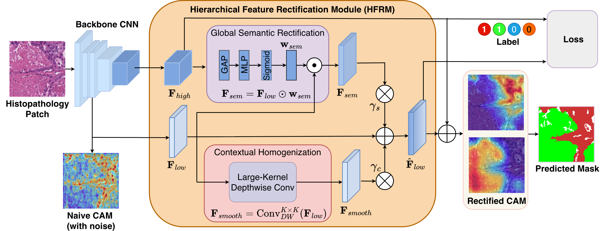

# SSHR: Single-Stage Hierarchical Rectification for Weakly Supervised Histopathology Segmentation (MICCAI 2026)

## Abstract
  <details>
  <summary>Click to expand</summary>

Existing weakly supervised semantic segmentation (WSSS) methods in computational pathology rely on a multi-stage paradigm: class activation map (CAM) generation, offline pseudo-mask refinement, and fully supervised retraining. While established, this decoupled approach presents fundamental limitations. The multi-stage process not only incurs high computational training costs but also suffers from error propagation: local texture biases in shallow CNN layers generate false-positive artifacts that subsequent refinement steps often fail to correct.

To address these persistent challenges through a simple yet highly effective approach, we propose the Single-Stage Hierarchical Rectification (SSHR) framework. Rather than passively refining CAMs post-hoc, our method proactively purifies intermediate feature representations during the forward pass. We introduce a Hierarchical Feature Rectification Module (HFRM) that utilizes deep global semantic context to filter out local anomalies in shallow layers. This mechanism generates high-fidelity activation maps directly within a single training loop.

Experiments on the LUAD-HistoSeg and BCSS datasets demonstrate that SSHR outperforms state-of-the-art multi-stage methods. Furthermore, SSHR reduces training duration by 2 to 5 times. This efficiency minimizes computational overhead and accelerates clinical translation for large-scale histopathology workflows.

**Keywords:** Weakly supervised learning, semantic segmentation, computational pathology, single-stage learning.

  </details>

## Framework


<p align="center">
  
</p>

## Directory Structure

```text
SSHR/
├── datasets/
│   ├── BCSS-WSSS/
│   │   ├── training/          # training images with image-level labels in filenames
│   │   ├── val/
│   │   │   ├── img/
│   │   │   └── mask/
│   │   └── test/
│   │       ├── img/
│   │       └── mask/
│   └── LUAD-HistoSeg/
│       ├── training/          # training images with image-level labels in filenames
│       ├── val/
│       │   ├── img/
│       │   └── mask/
│       └── test/
│           ├── img/
│           └── mask/
├── init_weights/              # pretrained initialization weights, ignored by git
└── checkpoints/               # training checkpoints, ignored by git
```


## Usage

### Step 1: Download Data and Weights

Download the pretrained classification initialization weight:

- [ImageNet initialization weight](https://drive.google.com/file/d/1Rka2SzqAwxUEFb28tbmiy2anhkkFOnTg/view?usp=drive_link)

Download the datasets:

- [LUAD-HistoSeg dataset](https://drive.google.com/file/d/1lWAeCp6UN30VRVmqv97kA2sJ1Pp2frhC/view?usp=drive_link)
- [BCSS-WSSS dataset](https://drive.google.com/file/d/178eSM9xs5jITt5P2kjaswDlJzwlU5gps/view?usp=drive_link)

Place the initialization weight at:

```text
init_weights/ilsvrc-cls_rna-a1_cls1000_ep-0001.params
```

Place the datasets under `datasets/` following the structure above.

### Step 2: Setup Environment

```bash
conda create -n sshr python=3.10 -y
conda activate sshr
pip install -r requirements.txt
pip install mxnet==1.9.1
pip install numpy==1.23.5
```


### Step 3: Run Training

LUAD-HistoSeg:
```bash
python train_sshr.py \
  --dataset luad \
  --trainroot datasets/LUAD-HistoSeg/training/ \
  --valroot datasets/LUAD-HistoSeg/val/ \
  --testroot datasets/LUAD-HistoSeg/test/ \
  --weights init_weights/ilsvrc-cls_rna-a1_cls1000_ep-0001.params \
  --save_folder checkpoints_luad
```

BCSS-WSSS:
```bash
python train_sshr.py \
  --dataset bcss \
  --trainroot datasets/BCSS-WSSS/training/ \
  --valroot datasets/BCSS-WSSS/val/ \
  --testroot datasets/BCSS-WSSS/test/ \
  --weights init_weights/ilsvrc-cls_rna-a1_cls1000_ep-0001.params \
  --save_folder checkpoints_bcss
```

## Acknowledgement

We thank the authors of [ESFAN](https://github.com/OceanPetal/ESFAN), whose codebase provided a valuable foundation for this repository.
